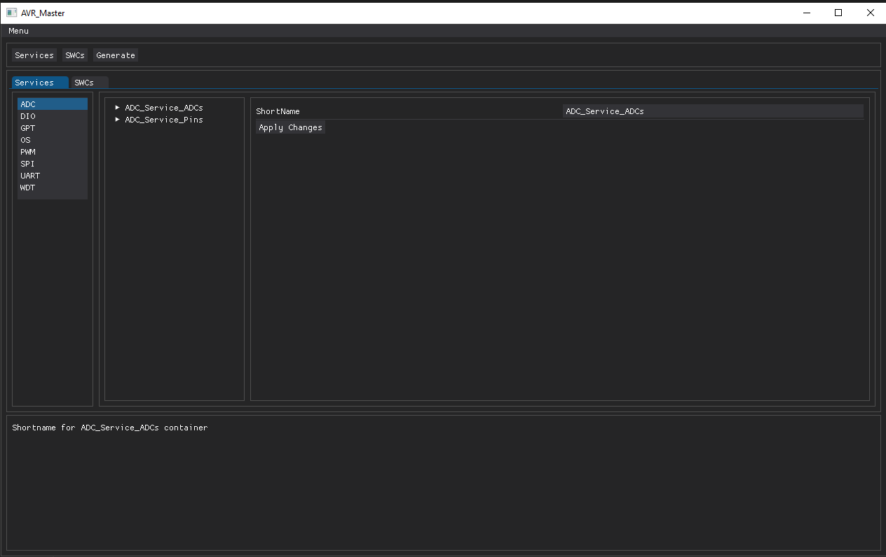

# Embedded_C_Generator
This project introduces an automated software generator aimed at enhancing the efficiency and reliability of embedded system development. It offers a flexible and easily configurable solution, enabling users to tailor software to the specific needs of their embedded systems.

## Features
Modular Architecture: The generator produces software based on a multi-layered architecture, encompassing hardware abstraction, services, and application components. This design ensures clear separation of concerns, facilitating easier maintenance and scalability.

Peripheral Management Services: Includes services for managing various peripherals such as ADCs, UART, SPI, and PWM. These services automate configuration and provide interfaces for interaction through a graphical user interface.

Programming Language Support: The generated software is written in C, offering low-level hardware control essential for embedded systems.

Graphical User Interface: Built using Python with DearPyGui library. The GUI provides an intuitive interface for configuring and generating software components.

Test Environment: Validated using a test setup with two Atmega328P microcontrollers configured as SPI Master and Slave, ensuring the reliability and functionality of the generated software.

## Dependencies
FreeRTOS: FreeRTOS is integrated into the generated software to manage concurrent tasks. [FreeRTOS](https://www.freertos.org/).

DearPyGui: A Python GUI library for creating interactive interfaces for the generator. [DearPyGui](https://github.com/hoffstadt/DearPyGui).

## UI
Configure Services:

Configure Software Components:

Main Window:

